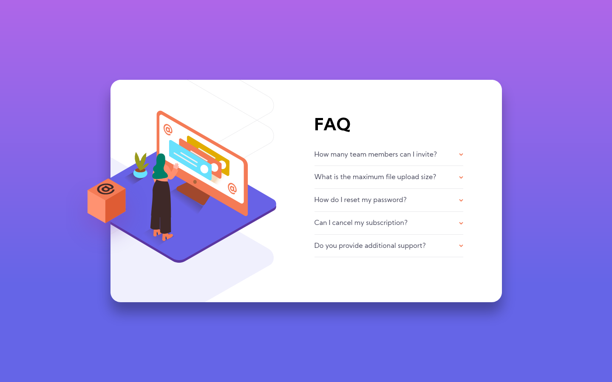

# Frontend Mentor - FAQ accordion card solution

This is a solution to the [FAQ accordion card challenge on Frontend Mentor](https://www.frontendmentor.io/challenges/faq-accordion-card-XlyjD0Oam). Frontend Mentor challenges help you improve your coding skills by building realistic projects.

## Table of contents

- [Overview](#overview)
  - [The challenge](#the-challenge)
  - [Screenshot](#screenshot)
  - [Links](#links)
- [My process](#my-process)
  - [Built with](#built-with)
  - [What I learned](#what-i-learned)
  - [Continued development](#continued-development)
  - [Useful resources](#useful-resources)
- [Author](#author)

## Overview

### The challenge

Users should be able to:

- View the optimal layout for the component depending on their device's screen size
- See hover states for all interactive elements on the page
- Hide/Show the answer to a question when the question is clicked

### Screenshot

### Links

- Live Site URL: [Solution](https://agusthas.github.io/faq-accordion-card-main/)

## My process

### Built with

- Semantic HTML5 markup
- SCSS
- Flexbox
- Mobile-first workflow

### What I learned

I can say that i"m really proud of how it turned out to be. I managed to learn that creating a sketch design first in Figma really helps me to structure my HTML and also how i style them.

Also i'm trying to force myself using a modular SCSS by secluding mixins, breakpoints, and config stuff inside a folder and use it on the main `style.scss` file. Its still not the best practices structure but at least i'm getting there! :sweat_smile:

### Continued development

- Adding more accessibility.
- Creating this with only CSS.
- Creating this same website but with React! :v:

### Useful resources

- [MDN Docs](https://developer.mozilla.org/en-US/) - This really helped me.

## Author

- Github - [agusthas](https://github.com/agusthas)
- Frontend Mentor - [@agusthas](https://www.frontendmentor.io/profile/agusthas)
- Twitter - [@agusthas](https://www.twitter.com/agusthas)
